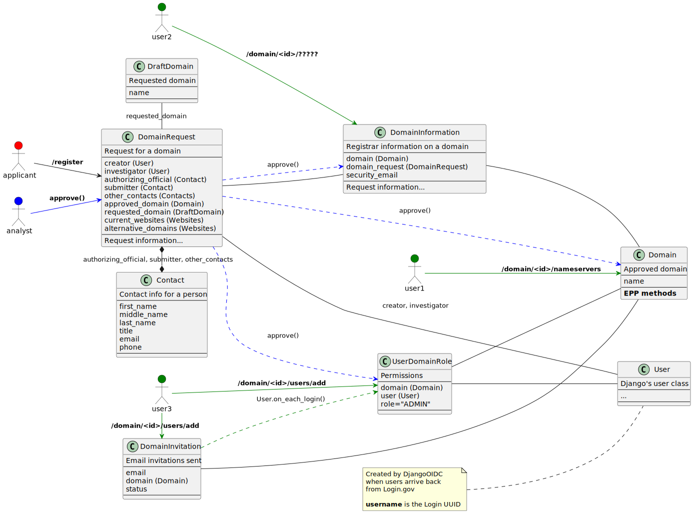

# Data Model Timeline

This diagram connects the data models along with various workflow stages.

1. The applicant starts the process at `/request` interacting with the
   `DomainRequest` object.

2. The analyst approves the domain request using the `DomainRequest`'s
   `approve()` method which creates many related objects: `UserDomainRole`,
   `Domain`, and `DomainInformation`.

3. After the domain is approved, users interact with various
   `/domain/<id>/...` views which make changes to the `Domain`,
   `DomainInformation`, and `UserDomainRole` models. For inviting new users,
   there is a `DomainInvitation` model that allows people to be added to
   domains who are not already users.

A more complete diagram of the data models, their fields, and their
relationships are in [models_diagram.md](./models_diagram.md), created with
the `django-model2puml` plugin.



<details>
<summary>PlantUML source code</summary>
To regenerate this image using Docker, run

```bash
$ docker run -v $(pwd):$(pwd) -w $(pwd) -it plantuml/plantuml -tsvg model_timeline.md
```


```plantuml
@startuml

allowmixing
left to right direction

class DomainRequest {
  Request for a domain
  --
  creator (User)
  investigator (User)
  senior_official (Contact)
  submitter (Contact)
  other_contacts (Contacts)
  approved_domain (Domain)
  requested_domain (DraftDomain)
  current_websites (Websites)
  alternative_domains (Websites)
  --
  Request information...
}

class User {
  Django's user class
  --
  ...
  --
}
note left of User
  Created by DjangoOIDC
  when users arrive back
  from Login.gov

  <b>username</b> is the Login UUID
end note

DomainRequest -l- User : creator, investigator

class Contact {
  Contact info for a person
  --
  first_name
  middle_name
  last_name
  title
  email
  phone
  --
}

DomainRequest *-r-* Contact : senior_official, submitter, other_contacts

class DraftDomain {
  Requested domain
  --
  name
  --
}

DomainRequest -l- DraftDomain : requested_domain

class Domain {
  Approved domain
  --
  name
  --
  <b>EPP methods</b>
}

DomainRequest .right[#blue].> Domain : approve()

class DomainInformation {
  Registrar information on a domain
  --
  domain (Domain)
  domain_request (DomainRequest)
  security_email
  --
  Request information...
}

DomainInformation -- Domain
DomainInformation -- DomainRequest
DomainRequest .[#blue].> DomainInformation : approve()

class UserDomainRole {
  Permissions
  --
  domain (Domain)
  user (User)
  role="ADMIN"
  --
}
UserDomainRole -- User
UserDomainRole -- Domain
DomainRequest .[#blue].> UserDomainRole : approve()

class DomainInvitation {
  Email invitations sent
  --
  email
  domain (Domain)
  status
  --
}
DomainInvitation -- Domain
DomainInvitation .[#green].> UserDomainRole : User.on_each_login()

actor applicant #Red
applicant -d-> DomainRequest : **/request**

actor analyst #Blue
analyst -[#blue]-> DomainRequest : **approve()**

actor user1 #Green
user1 -[#green]-> Domain : **/domain/<id>/nameservers**
actor user2 #Green
user2 -[#green]-> DomainInformation : **/domain/<id>/?????**
actor user3 #Green
user3 -right[#green]-> UserDomainRole : **/domain/<id>/users/add**
user3 -right[#green]-> DomainInvitation : **/domain/<id>/users/add**

@enduml
```

</details>
